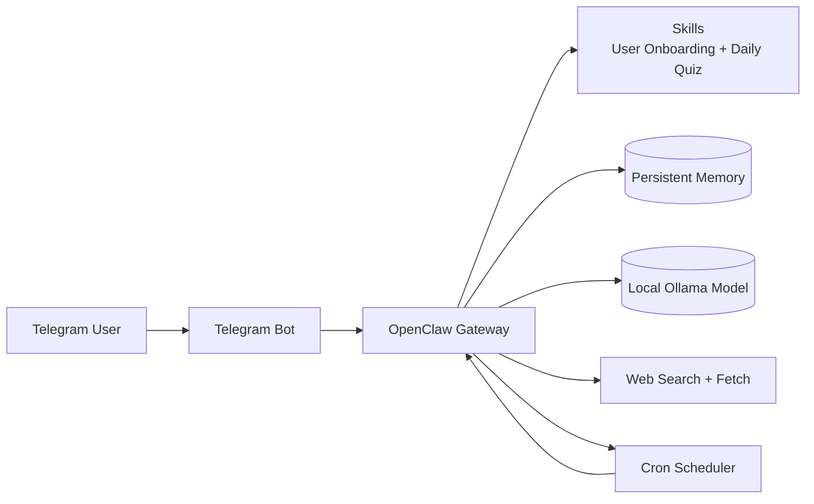

# 🦞 Personalized AI Learning Assistant — OpenClaw + Telegram

This project builds a self-hosted Telegram learning assistant with OpenClaw. It onboards new users, stores their technical preferences in persistent memory, and sends a daily 9 PM brief with exactly 5 interview questions and 3 to 5 technical tidbits tailored to their interests.

## Architecture Diagram



## What’s Included

- `skills/user-onboarding/SKILL.md` for the first-time onboarding flow
- `skills/daily-quiz/SKILL.md` for the nightly brief generation flow
- `config/openclaw.json` for model, Telegram, web search, cron, and memory setup
- `Dockerfile` and `docker-compose.yml` for containerized local deployment
- Ollama service and persistent named volume in `docker-compose.yml`
- `.env.example` for the required environment variables

## How It Works

1. A new Telegram user sends the bot a message.
2. A standing order checks whether `user_profile_{{user.id}}` exists in memory.
3. If no profile exists, the onboarding skill asks for domains, level, goals, and timezone.
4. The profile is saved to OpenClaw persistent memory.
5. A cron job named `nightly-tech-brief` runs every day at 9 PM in the user’s timezone.
6. The daily quiz skill reads memory, uses `web_search` for fresh content, formats the message in Telegram MarkdownV2, and sends it through Telegram.

## Component Overview

- `openclaw` runs the assistant, gateway, skills, cron scheduler, and Telegram delivery.
- `ollama` provides the local model so the project can run without an external AI API.
- `skills/user-onboarding/SKILL.md` captures the user's domains, level, goals, and timezone.
- `skills/daily-quiz/SKILL.md` generates the daily brief and handles the quiz conversation.
- `config/openclaw.json` wires together the model provider, Telegram plugin, web tools, standing order, cron job, and memory storage.
- `docker-compose.yml` starts the gateway and Ollama together with persistent named volumes.

## Setup

### Prerequisites

- Docker and Docker Compose v2
- Node.js 20+ if you want to run OpenClaw locally outside Docker
- A Telegram bot token from @BotFather
- Ollama installed locally if you want to run the assistant with a local model

### 1. Configure Environment Variables

Copy the example file and fill in your token:

```bash
cp .env.example .env
```

Set your Telegram token in `.env`:

```env
TELEGRAM_BOT_TOKEN=YOUR_TELEGRAM_BOT_TOKEN_HERE
```

If you use Ollama locally, keep `OLLAMA_BASE_URL=http://ollama:11434` for Docker Compose.

### 2. Review the OpenClaw Configuration

The submission includes a non-secret configuration snippet at `config/openclaw.json`. It already defines:

- the model provider setup
- the Telegram plugin
- `web_search` and `web_fetch`
- the onboarding standing order
- the `nightly-tech-brief` cron job

### 3. Start the Stack with Docker

```bash
docker compose up -d --build
```

Then check the services:

```bash
docker compose ps
docker compose logs -f openclaw
```

### 4. Test the Bot

1. Open Telegram and send a message to your bot.
2. Complete the onboarding questions.
3. Confirm the saved profile with:

```bash
openclaw memory get "user_profile_USER_ID"
```

4. Trigger the nightly brief manually if needed:

```bash
openclaw cron trigger "nightly-tech-brief"
```

## Design Choice: Standing Order for Onboarding

I used a standing order rather than a webhook because the onboarding trigger is already internal to OpenClaw and depends only on memory state. That keeps the implementation simpler, avoids public endpoint and TLS setup, and matches the project goal of running everything locally in a containerized environment.

## Architecture

The container setup is intentionally small and explicit:

- `openclaw` runs the gateway, skills, cron, Telegram delivery, and memory-backed assistant logic.
- `ollama` serves the local model used by the assistant and persists models in a named volume.
- `openclaw_data` preserves memory and logs between restarts.
- `skills/` is mounted read-only so skill updates can be edited without rebuilding the image.

This layout keeps the submission easy to review while still covering the full learning-assistant workflow end to end.

## Configuration Snippet

The submission config includes the full routing and scheduler setup used by the bot:

```json
{
  "skills": {
    "directory": "${env.OPENCLAW_SKILLS_DIR}",
    "entries": [
      {
        "name": "user-onboarding",
        "path": "skills/user-onboarding/SKILL.md",
        "enabled": true
      },
      {
        "name": "daily-quiz",
        "path": "skills/daily-quiz/SKILL.md",
        "enabled": true
      }
    ]
  },
  "standingOrders": [
    {
      "name": "trigger-user-onboarding",
      "description": "Automatically starts onboarding for any user whose profile does not exist in memory.",
      "condition": "memory.user_profile_{{user.id}} does not exist",
      "action": {
        "runSkill": "user-onboarding"
      },
      "enabled": true
    }
  ],
  "cron": {
    "jobs": [
      {
        "name": "nightly-tech-brief",
        "schedule": "0 21 * * *",
        "timezone": "${env.DEFAULT_CRON_TIMEZONE}",
        "session": "isolated",
        "channel": "telegram",
        "enabled": true
      }
    ]
  },
  "models": {
    "providers": {
      "ollama": {
        "enabled": true,
        "baseUrl": "${env.OLLAMA_BASE_URL}"
      }
    }
  },
  "plugins": {
    "entries": {
      "telegram": {
        "enabled": true,
        "package": "@openclaw/plugin-telegram",
        "config": {
          "botToken": "YOUR_TELEGRAM_BOT_TOKEN_HERE"
        }
      }
    }
  },
  "tools": {
    "web_search": {
      "enabled": true,
      "provider": "duckduckgo"
    },
    "web_fetch": {
      "enabled": true
    },
    "memory_store": {
      "enabled": true
    }
  }
}
```

## Troubleshooting

| Symptom                                       | Likely cause                       | Fix                                                                            |
| --------------------------------------------- | ---------------------------------- | ------------------------------------------------------------------------------ |
| `openclaw cron list` times out                | Gateway is not reachable yet       | Restart the gateway and rerun the CLI from the same shell                      |
| Telegram delivery stalls                      | Bot token or bot session issue     | Confirm `TELEGRAM_BOT_TOKEN` and test the bot in Telegram                      |
| Ollama does not start                         | Local model container is unhealthy | Recreate the Ollama container and verify `OLLAMA_BASE_URL=http://ollama:11434` |
| Windows CLI commands fail in a fresh terminal | PATH or shell session is stale     | Reopen the terminal or call the launcher from the installed location           |

## Design Rationale

The project keeps the moving parts intentionally small so the reviewer can trace the complete workflow quickly. Telegram handles the user interface, OpenClaw handles orchestration, Ollama provides local inference, and the skills encapsulate the learning logic. That separation makes the project easy to explain, easy to run locally, and easier to validate in a submission setting.

## File Structure

```text
.
├── skills/
│   ├── user-onboarding/SKILL.md
│   └── daily-quiz/SKILL.md
├── config/openclaw.json
├── Dockerfile
├── docker-compose.yml
├── .env.example
└── README.md
```

## Notes

- The Telegram bot token is intentionally left as a placeholder.
- The nightly brief must always contain exactly 5 questions and 3 to 5 tidbits.
- The daily skill uses recent web search results to keep the brief fresh and relevant.
- Verified during submission prep with OpenClaw 2026.5.x using the default runtime config.
- Telegram delivery, Ollama model selection, cron execution, and skill loading were all exercised end to end.
- Isolated cron mode may be environment-sensitive on Windows, so the stable non-isolated path is the recommended submission baseline.
