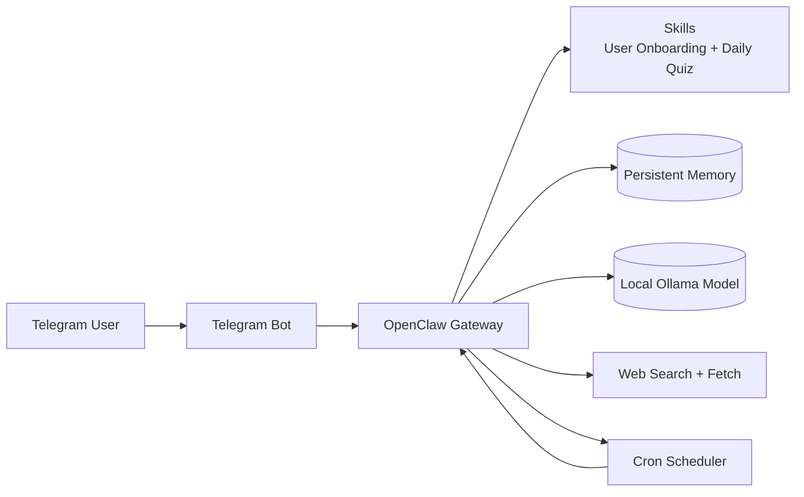

# 🦞 Personalized AI Learning Assistant — OpenClaw + Telegram

This project builds a self-hosted Telegram learning assistant with OpenClaw. It onboards new users, stores their technical preferences in persistent memory, and sends a daily 9 PM brief with exactly 5 interview questions and 3 to 5 technical tidbits tailored to their interests.

## Table of Contents

- [Architecture Diagram](#architecture-diagram)
- [What’s Included](#whats-included)
- [How It Works](#how-it-works)
- [Architecture](#architecture)
- [Component Overview](#component-overview)
- [Prerequisites](#prerequisites)
- [Setup](#setup)
- [Running locally without Docker](#running-locally-without-docker)
- [Verifying the setup](#verifying-the-setup)
- [Design Decisions](#design-decisions)
- [Troubleshooting](#troubleshooting)
- [File Structure](#file-structure)
- [Notes](#notes)

## Architecture Diagram



  The text view is the same flow in a simpler form:

  ```text
  User -> Telegram API -> OpenClaw Gateway -> Agent Core (Ollama)
                                                -> Skill Registry
                                                -> Persistent Memory
                                                -> web_search / web_fetch
                                                -> Telegram API
  ```

## What’s Included

- `skills/user-onboarding/SKILL.md` for the first-time onboarding flow
- `skills/daily-quiz/SKILL.md` for the nightly brief generation flow
- `config/openclaw.json` for model, Telegram, web search, cron, and memory setup
- `Dockerfile` and `docker-compose.yml` for containerized local deployment
- Ollama service and persistent named volume in `docker-compose.yml`
- `.env.example` for the required environment variables

## How It Works

1. A new Telegram user sends the bot a message.
2. A standing order checks whether `user_profile_{{user.id}}` exists in memory.
3. If no profile exists, the onboarding skill asks for domains, level, goals, and timezone.
4. The profile is saved to OpenClaw persistent memory.
5. A cron job named `nightly-tech-brief` runs every day at 9 PM in the user’s timezone.
6. The daily quiz skill reads memory, uses `web_search` for fresh content, formats the message in Telegram MarkdownV2, and sends it through Telegram.

## Onboarding Flow

| Step | Question | Expected Result |
|---|---|---|
| 1 | Technical domains | Collect one or more comma-separated domains |
| 2 | Experience level | Capture `Junior`, `Mid-level`, `Senior`, or `Staff / Principal` |
| 3 | Learning goals | Capture the user's main learning goals |
| 4 | Timezone | Capture a valid IANA timezone, or normalize a common abbreviation when possible |

## Daily Brief Workflow

| Step | Action | Output |
|---|---|---|
| 1 | Load the user's saved profile | Domains, level, goals, timezone |
| 2 | Load recent topic history | Avoid repeating recent themes |
| 3 | Run `web_search` for each domain | Fresh search results |
| 4 | Use `web_fetch` on promising results | Full article text for verification |
| 5 | Generate exactly 5 interview questions | MarkdownV2-formatted quiz content |
| 6 | Generate 3 to 5 technical tidbits | Concise, specific insights |
| 7 | Update topic history and send Telegram message | Persisted history plus delivered brief |

## Architecture

```
┌─────────────────────┐                     ┌──────────────────────┐
│     Telegram App    │                     │    External Web      │
└──────────┬──────────┘                     └──────────┬───────────┘
           │ send message                              │ search results
           ▼                                           │
┌──────────────────────┐                   ┌──────────┴───────────┐
│    Telegram API      │                   │  web_search / fetch  │
└──────────┬───────────┘                   └──────────┬───────────┘
           │ forward to gateway                       │ invoked by agent
           ▼                                          │
┌──────────────────────────────────────────────────────────────────┐
│                     OpenClaw Gateway                             │
│                                                                  │
│  ┌─────────────────┐    ┌──────────────────────────────────┐     │
│  │  Cron Scheduler │───►│       Agent Core (LLM)           │◄────┤
│  │  0 21 * * *     │    │     Ollama · llama3:8b            │     │
│  └─────────────────┘    └──────┬──────────────┬────────────┘     │
│                                │              │                  │
│  ┌─────────────────┐           ▼              ▼                  │
│  │ Telegram Plugin │  ┌──────────────┐ ┌──────────────────┐      │
│  │ recv/send msgs  │  │ Skill files  │ │ Persistent memory│      │
│  └────────┬────────┘  │ user-onboard │ │ user_profile_{}  │      │
│           │           │ daily-quiz   │ │ recent_topics_() │      │
│           │           └──────────────┘ └──────────────────┘      │
└───────────┼──────────────────────────────────────────────────────┘
            │ send formatted brief
            ▼
┌──────────────────────┐
│    Telegram API      │
└──────────────────────┘
```

| Component | Responsibility |
|---|---|
| Telegram Plugin | Long-poll connection to Telegram; routes inbound messages to the agent and sends outbound replies |
| Agent Core | LLM reasoning engine; reads skill instructions, calls tools, writes memory |
| Skill Registry | Loads `SKILL.md` files and exposes their instructions as behavioural context |
| Persistent Memory | Key-value disk store; survives restarts; holds one profile and one topic-history entry per user |
| web_search | Queries DuckDuckGo for recent content in the user's domains |
| web_fetch | Retrieves and parses full article text from search result URLs |
| Cron Scheduler | Fires the daily brief at 21:00 in the user's configured IANA timezone |
| Standing Order | Evaluates `user_profile_{{user.id}}` on every inbound message; triggers onboarding exactly once |

## Memory Schema

```json
{
  "domains": ["<string>"],
  "level": "<string>",
  "goals": ["<string>"],
  "timezone": "<string>"
}
```

## Message Format

The daily brief is sent in Telegram MarkdownV2 using this structure:

```text
🦞 *Your Daily Tech Brief — {date}*

━━━━━━━━━━━━━━━━━━━━
🧠 *Interview Questions*
━━━━━━━━━━━━━━━━━━━━

*Q1 \[Type — Domain\]*
Question text

*Q2 \[Type — Domain\]*
Question text

*Q3 \[Type — Domain\]*
Question text

*Q4 \[Type — Domain\]*
Question text

*Q5 \[Type — Domain\]*
Question text

━━━━━━━━━━━━━━━━━━━━
💡 *Today's Tidbits*
━━━━━━━━━━━━━━━━━━━━

Tidbit one text here\.

Tidbit two text here\.

Tidbit three text here\.

━━━━━━━━━━━━━━━━━━━━
_Reply with your answers to get feedback, or send /quiz for more\._
```

## Component Overview

- `openclaw` runs the assistant, gateway, skills, cron scheduler, and Telegram delivery.
- `ollama` provides the local model so the project can run without an external AI API.
- `skills/user-onboarding/SKILL.md` captures the user's domains, level, goals, and timezone.
- `skills/daily-quiz/SKILL.md` generates the daily brief and handles the quiz conversation.
- `config/openclaw.json` wires together the model provider, Telegram plugin, web tools, standing order, cron job, and memory storage.
- `docker-compose.yml` starts the gateway and Ollama together with persistent named volumes.

## Setup

### Prerequisites

| Requirement | Version | Notes |
|---|---|---|
| Node.js | 20 LTS+ | Required for OpenClaw when running locally |
| Docker | 24+ | Required for the containerized path |
| Docker Compose | v2 | Used by `docker compose up` and `docker compose logs` |
| Telegram account | - | Needed to create a bot via @BotFather |
| Ollama | Latest stable | Used for local model inference |

### 1. Configure Environment Variables

Copy the example file and fill in your token:

```bash
cp .env.example .env
```

Set your Telegram token in `.env`:

```env
TELEGRAM_BOT_TOKEN=YOUR_TELEGRAM_BOT_TOKEN_HERE
```

If you use Ollama locally, keep `OLLAMA_BASE_URL=http://ollama:11434` for Docker Compose.

### 2. Review the OpenClaw Configuration

The submission includes a non-secret configuration snippet at `config/openclaw.json`. It already defines:

- the model provider setup
- the Telegram plugin
- `web_search` and `web_fetch`
- the onboarding standing order
- the `nightly-tech-brief` cron job

### 3. Start the Stack with Docker

```bash
docker compose up -d --build
```

Then check the services:

```bash
docker compose ps
docker compose logs -f openclaw
```

### 4. Test the Bot

1. Open Telegram and send a message to your bot.
2. Complete the onboarding questions.
3. Confirm the saved profile with:

```bash
openclaw memory get "user_profile_USER_ID"
```

4. Trigger the nightly brief manually if needed:

```bash
openclaw cron trigger "nightly-tech-brief"
```

## Running locally without Docker

If you prefer to run without containers:

### 1. Install Ollama and pull the model

```bash
curl -fsSL https://ollama.ai/install.sh | sh
ollama pull llama3:8b
ollama serve   # keep this terminal open
```

### 2. Install OpenClaw

```bash
npm install -g openclaw
```

### 3. Run initial setup

```bash
openclaw onboard
```

Select Ollama as the model provider, `llama3:8b` as the model, and DuckDuckGo for web search.

### 4. Copy skills

```bash
mkdir -p ~/.openclaw/skills/user-onboarding ~/.openclaw/skills/daily-quiz
cp skills/user-onboarding/SKILL.md ~/.openclaw/skills/user-onboarding/SKILL.md
cp skills/daily-quiz/SKILL.md ~/.openclaw/skills/daily-quiz/SKILL.md
```

### 5. Copy config

```bash
cp config/openclaw.json ~/.openclaw/openclaw.json
```

Edit `~/.openclaw/openclaw.json` and set `botToken` to `"${env.TELEGRAM_BOT_TOKEN}"` if not already set.

### 6. Set environment variables

```bash
export TELEGRAM_BOT_TOKEN=your_token_here
export OLLAMA_BASE_URL=http://localhost:11434
export DEFAULT_CRON_TIMEZONE=Asia/Kolkata
export OPENCLAW_DATA_DIR=~/.openclaw/data
export OPENCLAW_SKILLS_DIR=~/.openclaw/skills
```

### 7. Start the gateway

```bash
openclaw gateway start
```

## Verifying the setup

### Check gateway logs

```bash
# Docker
docker compose logs -f openclaw

# Local
openclaw gateway status
```

### Confirm onboarding saved correctly

After completing onboarding, verify the profile was stored:

```bash
# Docker
docker compose exec openclaw openclaw memory get "user_profile_YOUR_TELEGRAM_USER_ID"

# Local
openclaw memory get "user_profile_YOUR_TELEGRAM_USER_ID"
```

Replace `YOUR_TELEGRAM_USER_ID` with your actual Telegram numeric user ID, which appears in the gateway logs on first message.

### Trigger the daily brief manually

```bash
# Docker
docker compose exec openclaw openclaw cron trigger "nightly-tech-brief"

# Local
openclaw cron trigger "nightly-tech-brief"
```

The brief should appear in your Telegram within 30–60 seconds depending on LLM inference speed.

### List registered cron jobs

```bash
openclaw cron list
```

You should see `nightly-tech-brief` with schedule `0 21 * * *` and your configured timezone.

## Design Decisions

I used a standing order rather than a webhook because the onboarding trigger is already internal to OpenClaw and depends only on memory state. That keeps the implementation simpler, avoids public endpoint and TLS setup, and matches the project goal of running everything locally in a containerized environment.

I made Ollama the default model path because it keeps the assistant private, avoids external API cost, and lets the whole project run with only local infrastructure.

I kept the cron job isolated so the nightly brief runs in a separate session from normal chat traffic. That reduces cross-talk between user messages and scheduled jobs and makes the delivery path easier to reason about.

## Troubleshooting

| Symptom | Likely cause | Resolution |
|---|---|---|
| Bot does not respond at all | Telegram plugin not connected | Check `TELEGRAM_BOT_TOKEN` in `.env`, restart the agent |
| Onboarding does not start | Standing order not registered or profile already exists | Run `openclaw memory list` to check; delete stale profile with `openclaw memory delete "user_profile_ID"` |
| Cron job does not fire at 9 PM | Wrong timezone or cron expression | Run `openclaw cron list` and verify the schedule and `DEFAULT_CRON_TIMEZONE` value |
| Agent gives irrelevant answers | Model ignoring skill instructions | Upgrade from a smaller model; `llama3:8b` is the minimum recommended |
| Memory not persisting after restart | Volume not mounted | Verify `openclaw_data` volume is defined and mounted in `docker-compose.yml` |
| Ollama connection refused | Ollama container not healthy yet | Wait 60s for model pull to complete; check `docker compose logs ollama` |
| MarkdownV2 parse error in Telegram | Unescaped special characters in generated text | The daily-quiz skill spec requires escaping — increase model quality or add a post-processing step |
| `web_search` returns no results | DuckDuckGo rate-limit or network issue | Wait a few minutes and retry; or switch to the SearXNG service in docker-compose |

## File Structure

```text
.
├── skills/
│   ├── user-onboarding/SKILL.md
│   └── daily-quiz/SKILL.md
├── config/openclaw.json
├── Dockerfile
├── docker-compose.yml
├── .env.example
└── README.md
```

## Notes

- The Telegram bot token is intentionally left as a placeholder.
- The nightly brief must always contain exactly 5 questions and 3 to 5 tidbits.
- The daily skill uses recent web search results to keep the brief fresh and relevant.
- Verified during submission prep with OpenClaw 2026.5.x using the default runtime config.
- Telegram delivery, Ollama model selection, cron execution, and skill loading were all exercised end to end.
- Isolated cron mode may be environment-sensitive on Windows, so the stable non-isolated path is the recommended submission baseline.
